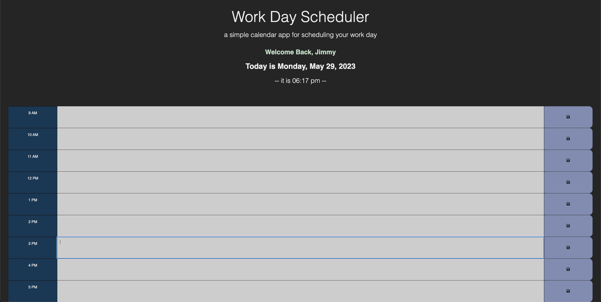
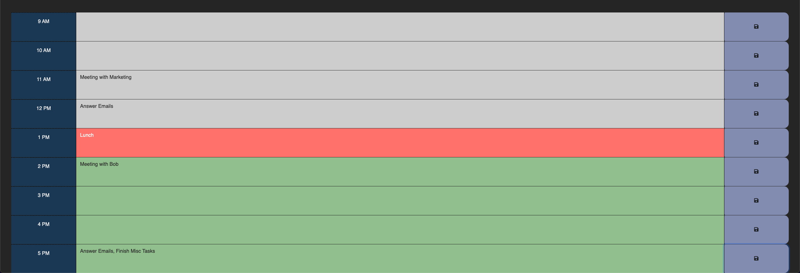

# Work-Day-Planner

## What Is It?

A simple planner optimized for a 9-5 workday. Action items are saved in the user's local memory to be recalled upon page load, and the planner gives graphical feedback based on the current real time.

## Where Is It?

You can find and use the planner at [corynko.github.io/Work-Day-Planner](https://corynko.github.io/Work-Day-Planner)

## How Do I Use It?

First, fill in your name. Once you press ok, the calendar will load. Click on an hour and type in your tasks for that hour, then press the save button the right. Set this planner as your new tab page to pull it up more often during your day. The hour blocks will change color to communicate where you are in your day at a glance, as in the second screenshot taken during lunch.

## Who Can Use It?

This planner is completely open source and available to anyone to use or modify to suit your needs.
